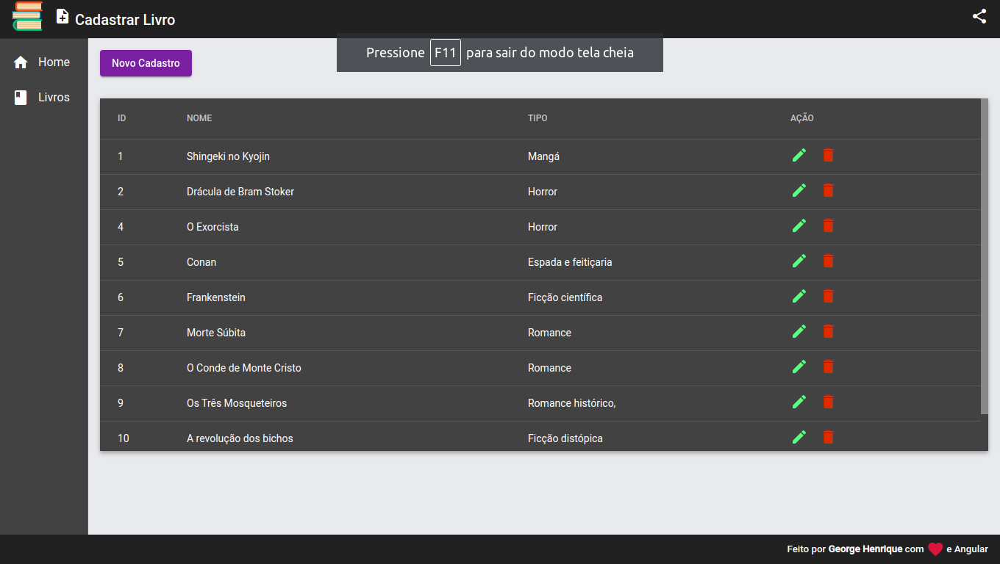

# Projeto Crud Angular Cod3r
### Com Angular e Json Server

Fiz esse curso na intenção de usar os conhecimentos de para consumir uma api **Spring Rest**.

Mais acabei gostando muito da componentização do **Angular** principalmente pelo uso do **Material Design** que ajuda muito na rapidez da criação de componentes ainda mais pelo uso do cli do **Angular**, eu acho que talvez eu use ele como **framework** principal de frontend.

